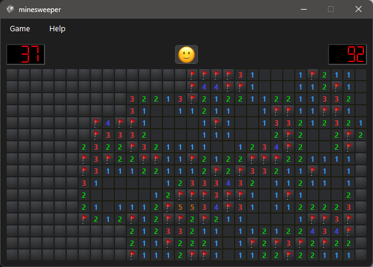

# Minesweeper

[](https://github.com/nholthaus/minesweeper/actions/workflows/build.yml) []()

A free C++/Qt implementation of minesweeper, now with dark mode!

Download the latest Windows installer [here](https://github.com/nholthaus/minesweeper/releases/tag/1.0.4). For MacOS or Linux, [build it from source](#build-instructions-macoslinux)




## Build Instructions (MacOS/Linux)

You'll need CMake, a C++20 compiler (e.g. g++13 or clang-18) and Qt 6.7.2 or newer with the `qtscxml` module installed.

```bash
git clone https://github.com/nholthaus/minesweeper.git
cd minesweeper
mkdir build
cd build
cmake -DCMAKE_BUILD_TYPE=Release ..
cmake --build . --target minesweeper -- -j
./bin/minesweeper
```